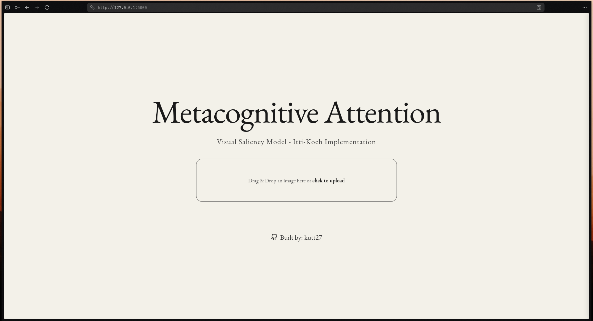

# Metacognitive Attention

Visual Saliency Model implementation based on the Itti-Koch architecture. This project focuses on the core implementation in `Metacognitive_Attention.ipynb`.

For more details, refer to the [Metacognitive Attention.ipynb](Metacognitive_Attention.ipynb).

To run this project, create a directory called `uploads` in the same directory as `app.py`.

Application:


After processing:


## Working
1. Install dependencies:
   ```bash
   pip install -r requirements.txt
   ```
2. Run the application:
   ```bash
   python app.py
   ```
3. Open [http://localhost:5000](http://localhost:5000) in your browser.

## 📄 License
MIT License
